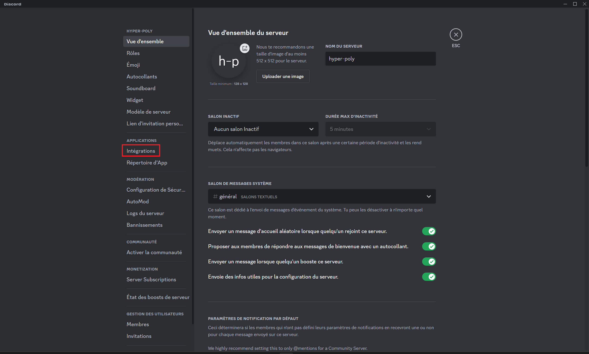
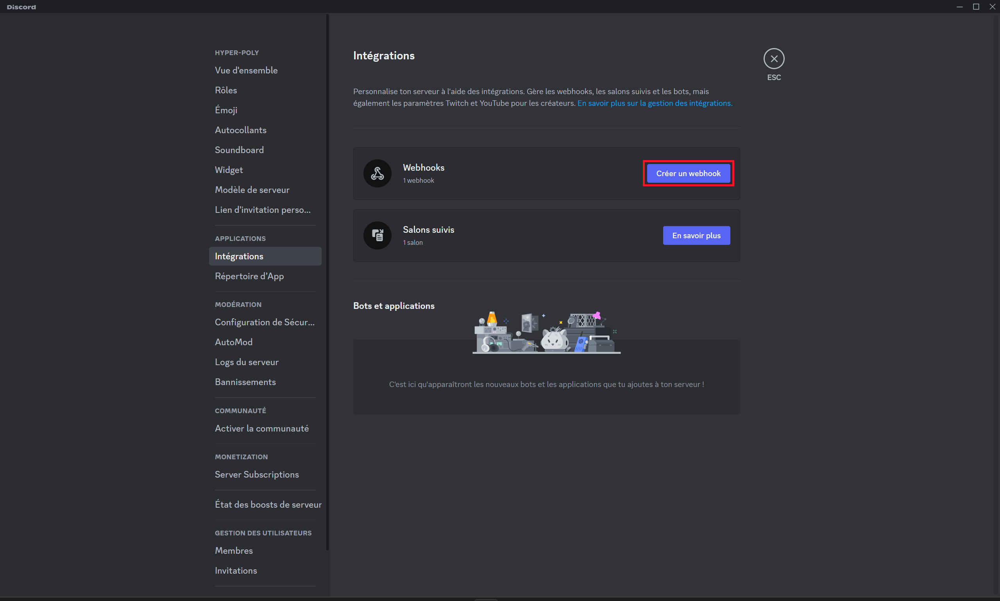
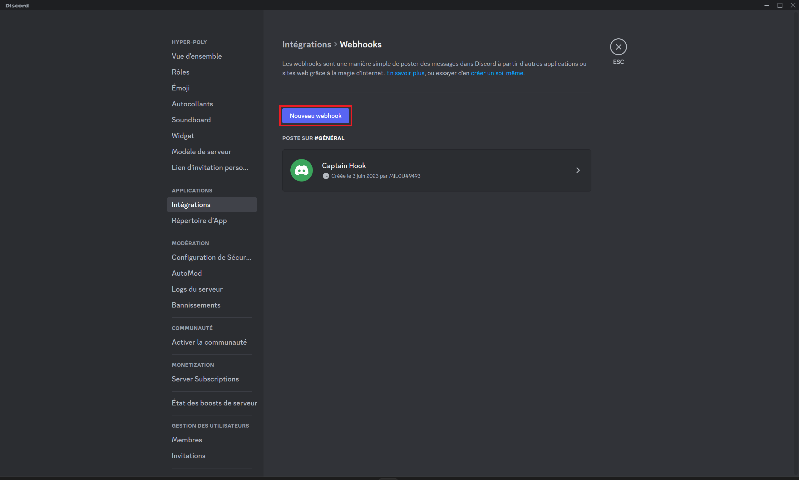
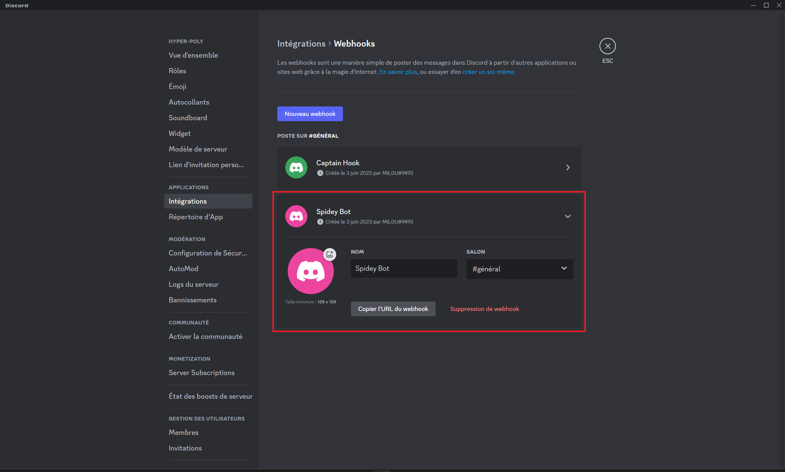
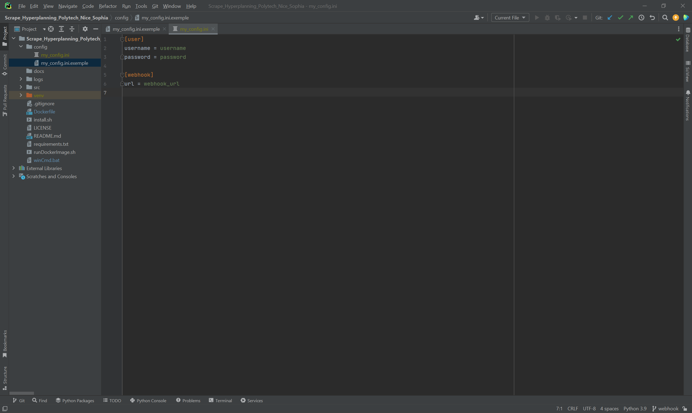

# Scrape Hyperplanning Polytech Nice Sophia

Le but de cette application est d'être notifié dès qu'une nouvelle note est ajouté à Hyperplanning.

Pour ce faire, nous avons 2 étapes :
- Création d'un webhook Discord
- Lancer l'application

Cette application utilise la version 3.11 de Python (https://firefox-source-docs.mozilla.org/testing/geckodriver/Support.html). Il utilise la librairie Selenium avec Mozilla Firefox-esr v102.11.0
et geckodriver v0.33.0 comme WebDriver (https://github.com/mozilla/geckodriver/releases).

### Création d'un webhook Discord

Aller dans les paramètres du serveur et ensuite sélectionner "Intégrations" :

Cliquer sur "Crée un webhook" :

Cliquer sur "Nouveau webhook" :

Il suffit maintenant de customiser comme vous le souhaiter :

### Lancé l'application

##### Avec Docker

- Premièrement il faut installer Docker sur votre machine : https://docs.docker.com/engine/install/
- Ensuite vous devez créer et remplir le fichier de configuration : my_config.ini comme dans l'exemple : [exemple](config/my_config.ini.exemple)

- Il n'y a plus qu'à exécuter le script qui va build et run l'image docker :
  - linux : [runDockerImage.sh](runDockerImage.sh) (il faut rendre le exécutable grâce à cette commande : `chmod +x runDockerImage.sh`)
  - cmd/powerShell : [runDockerImage.bat](runDockerImage.bat)

##### Sans Docker (en cours)

[//]: # (- Premièrement il faut installer python v3.11 sur votre machine :)

[//]: # (    - Sur linux : `./installPython3.11.sh` car Python 3.11 n'est pas encore disponible dans les dépôts officiels d'Ubuntu &#40;il faut rendre le script executable grace à cette commande : `./installPython3.11.sh`&#41;)

[//]: # (    - Sur windows : [python3.11]&#40;https://www.python.org/downloads/&#41;, lors du télégarghement veiller à clicker sur : "Add python to environnement variable" &#40;si la `python --version` ne vous renvoie pas "Python 3.11.x"&#41;)

[//]: # (- Il faut aussi avoir téléchargé firefox :)

[//]: # (  - Sur linux : `sudo apt-get update` puis `sudo apt install firefox`)

[//]: # (  - Sur windows : [firefox]&#40;https://www.mozilla.org/fr/firefox/new/&#41;)

[//]: # (- Il suffit maintement d'executer le script d'execution :)

[//]: # (  - linux : )

[//]: # (  - cmd :)

[//]: # (  - powerShell :)
